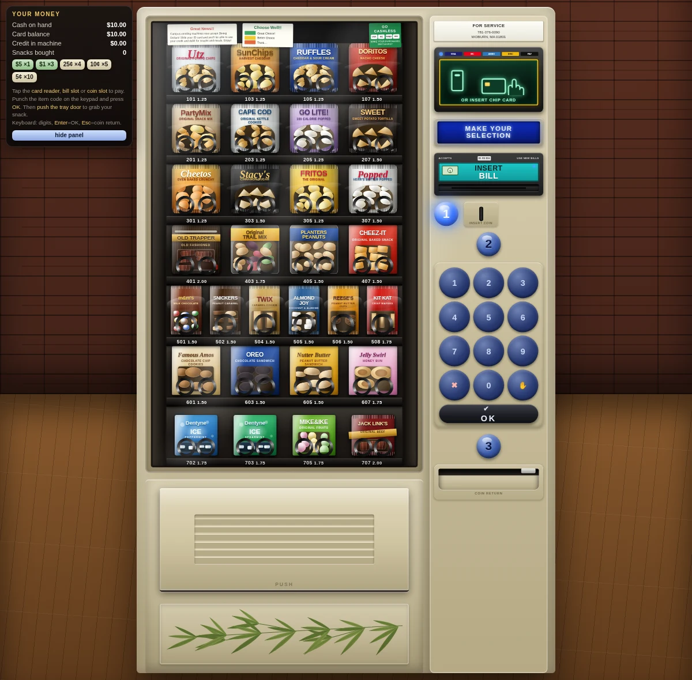
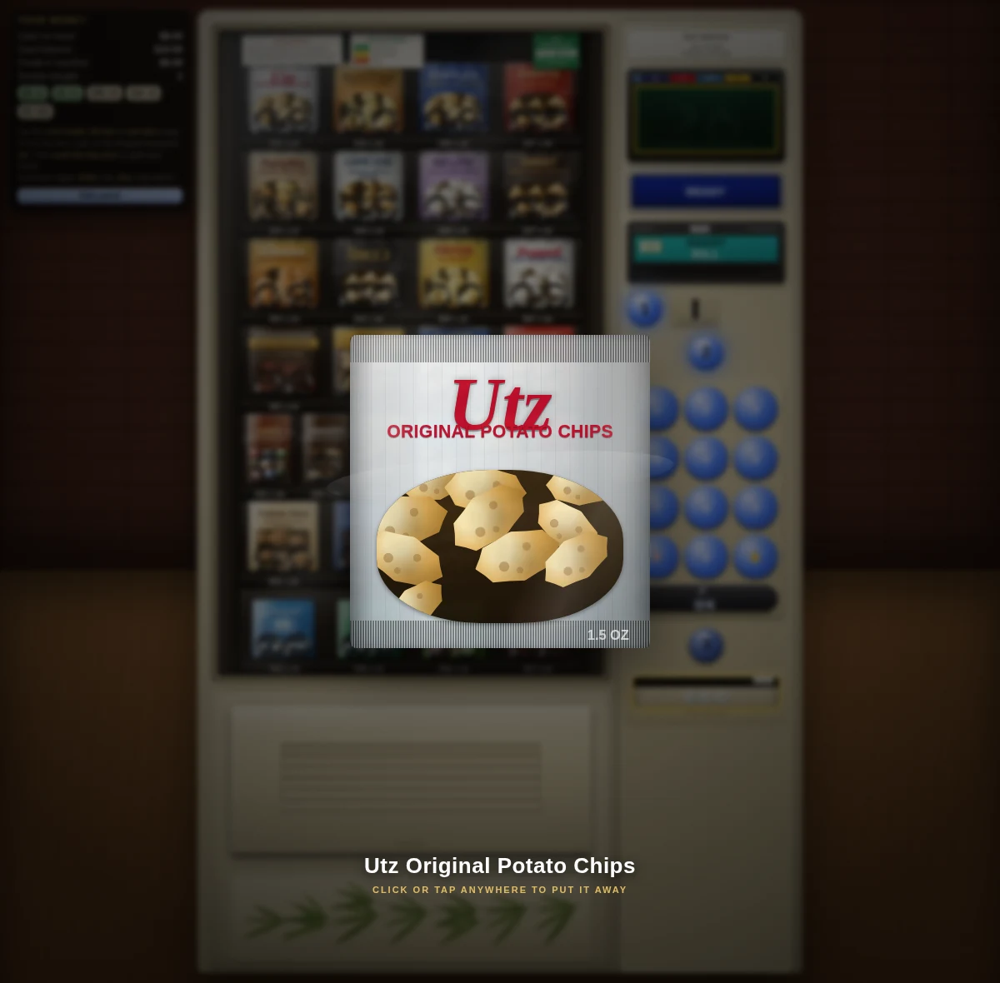

# Vending Machine Simulator

A janky looking snack vending machine you can actually operate! Pay by card, bill, or coin! Punch a
slot code! Watch the coil turn! Push the tray door open and grab your snack.



## Run it

```
Open index.html in any modern browser.
```

That's it — double-click the file, or drag it into a browser window. It works from `file://` with
no server. Sound effects (coin drop, keypad beeps, vend motor, thud) are synthesized with the Web
Audio API and start after your first interaction, per browser autoplay policy.

## The original prompt

The page was built with Claude Opus 5 and reference images from
[UI/UX Critique Journal — Day 2](https://medium.com/%40danlimonchik/ui-ux-critique-journal-day-2-e0dbedded181).
It is the same type of vending machine I encountered in the wild. After sitting and staring at
one in a waiting room, I was inspired to describe it in detail. The prompt I wrote on my phone
is reproduced below:

> Create for me a vending machine simulator. The machine will have a large glass window with
> snacks such as chips, candy bars, nuts, trail mix and beef jerky. Below the glass window is a
> dispensing tray that you have to push forward to retrieve the snack. On the right side of the
> machine top to bottom: yellow outlined LCD screen that accepts card payment either as tap or
> chip insertion. Its screen shows an animation of the way to use it showing an hand tapping then
> a hand inserting a card. It also shows a screen with the type of cards accepted. The animation
> loops. Below this is a vacuum florescent display that says ready then make your selection
> alternating while idle. It will show your selection and how much you have inserted during
> purchase process. Below that is a dollar insertion slot with sticker with a sticker showing a
> dollar being inserted. Below that is a coin slot with a big light up clear blue circle labeled
> "1" next to it. Below that is a number pas work blue light up buttons and a big number "2" light
> up above the number pad on its own row at the top. There is a big rectangular OK button at the
> bottom of the keypad spanning the whole width. Below that is a bit circle number '3' light up.
> Just below it is the coin return tray. The numbered 1 through 3 lights and number pad show a
> light up animation where they light up from top to bottom with a delay between each row lighting
> up. Once all rows are lit it pauses then the lighting animation resumes. The whole unit is
> beige. Across the bottom just under and behind the food retrieval tray is an upside down bamboo
> leaf. The simulator should allow operation of all payment mechanisms, item selection through the
> key pad and food retrieval from the tray. When inserting coins or dollars you should be able to
> get change. The player gets a fixed amount of money for food, say $10 initially. When food is
> retrieved an animation shows it expand towards the player with transparency. It will remain till
> the player clicks it away. Implement as a single HTML page with no CDN usage or external
> dependencies. Do not require node. The page should be loadable and usable by just loading the
> HTML in a browser. It should be designed with both computer and mobile use in mind with a
> responsive design. Both mouse and touch interaction should be supported. make the snacks look
> realistic. Make the resulting vending machine look as close to the reference images as possible.

Claude wants you to think it built this in one shot, but that is all hubris. It originally had
these crooked coils in front of the snacks. Then the snacks themselves were so boring that I had
to keep nudging it to do better. And they still look like shit! Without the reference images,
Claude was not able to create something that looked like a real vending machine.

## Playing it

Figure it out—it’s a vending machine. It’s not supposed to require a manual. Put in some money
and punch some buttons. You are rewarded with crude animations and sound effects.


